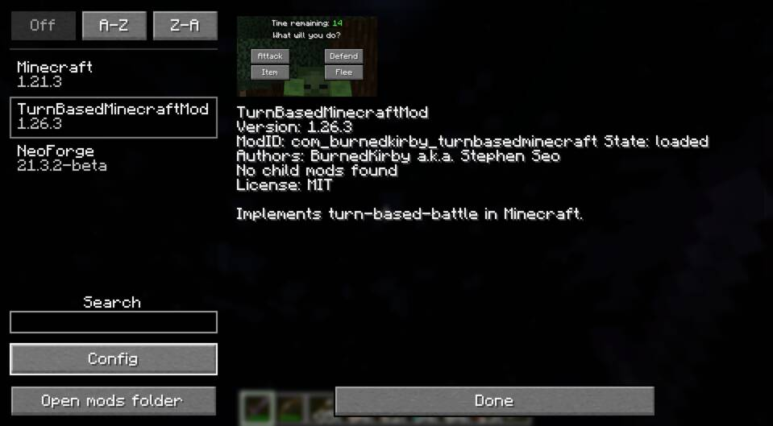
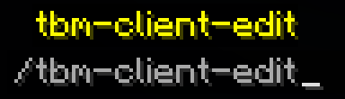
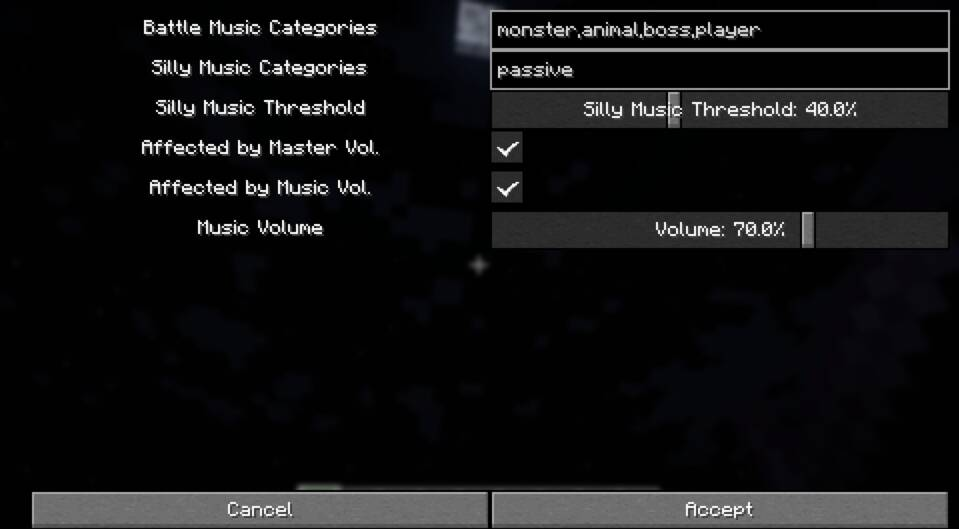

# Client-side Config

The client config can be opened in two ways.

One way is via the mod-list (only works in NeoForge, not Forge).

The other way is via the `/tbm-client-edit` command.

Currently, the client config allows for configuration for client-side music
playback.

The "categories" settings are comma-separated words that define what "category"
triggers the "battle" music or the "silly" music.

"Silly Music Threshold" determines the percentage of silly-category-mobs in
battle required to play silly music. This means if the setting is 49%, and there
is one player, one zombie, and two sheep in battle, then the game will play
silly music (since 50% of the combatants are sheep and is greater than 49%).
