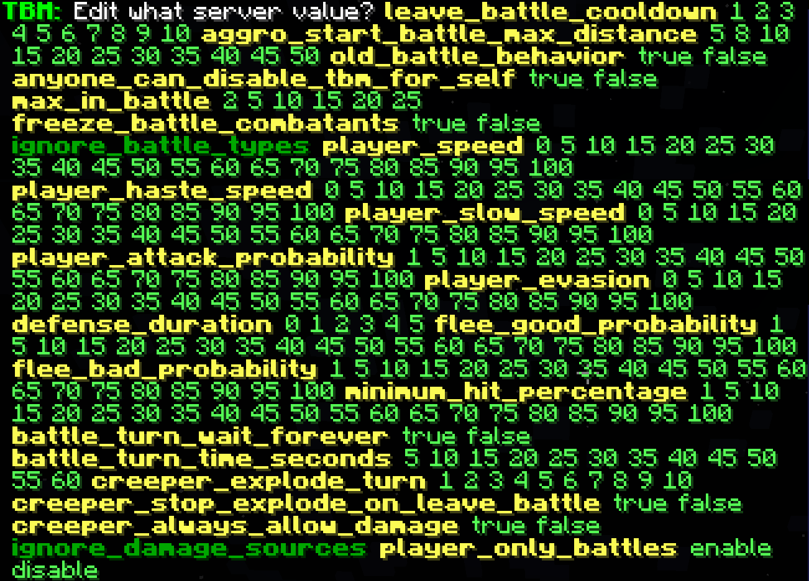
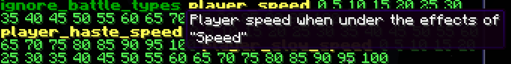
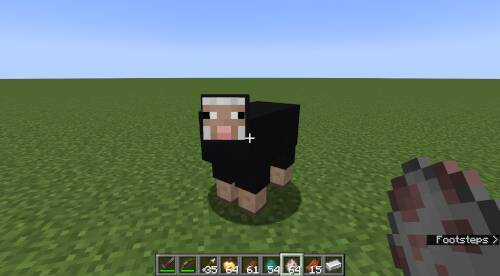
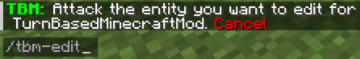
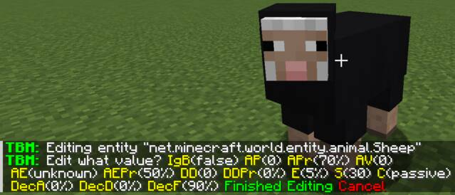
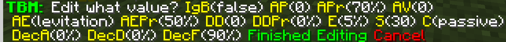
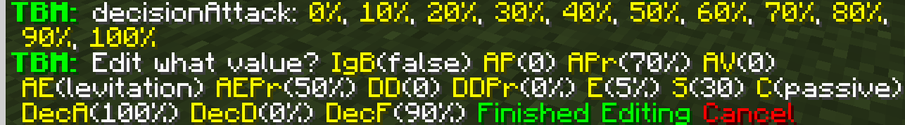
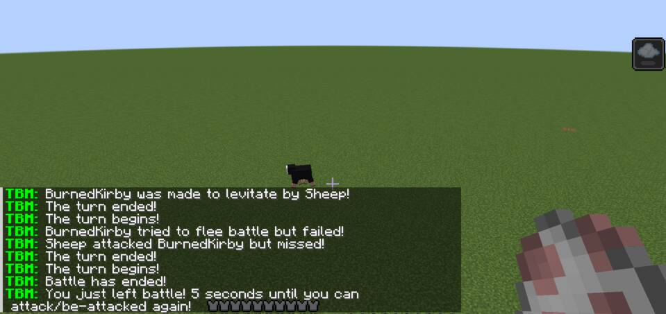
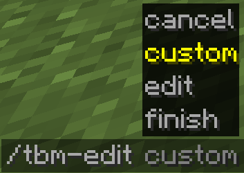
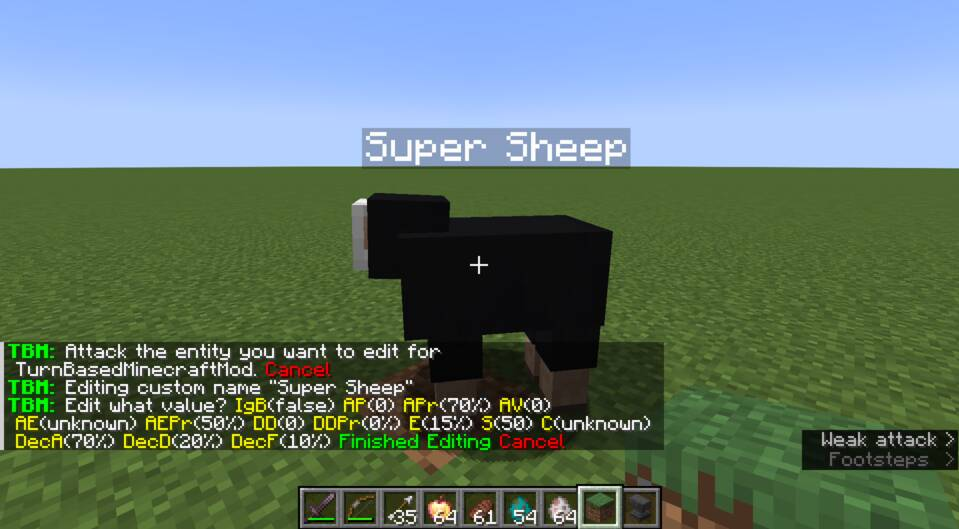

# Server-side Config

Invoke `/tbm-server-edit` to print out server settings to the "chat" area.

In this text area, yellow texts are setting names, green texts are setting
values that can be set when clicked on, and dark-green texts are settings that
display more settings when clicked on.

!!! note
    You can hover/click these texts by pressing the "t" key to open the chatbox,
    and using the mouse.

When clicking on the dark-green texts, a description and list is shown. You can
hover over the text to show what actions may occur when clicked.

On click, the action taken will be shown.

It is also possible to set config settings via a command, but it is recommended
to use the "click-on-chat" interface for general server config settings.

## Per-Mob Settings

To demonstrate setting "per-mob" settings, it will be shown how to do so with
sheep.

Invoke `/tbm-edit`. Some helpful text will show.

At this point, TBMM (TurnBasedMinecraftMod) will be keeping track of who you
will attack next, so that you can edit their settings. Currently this only
applies to mobs like sheep, zombies, skeletons, bees, etc. This is done so that
you can physically select the mob you want to "edit".

In this example, the "AE" (attack effect) setting will be changed to
"levitation", which will cause the sheep to make the player levitate 50% of the
time.

Also, "DecisionAttack" will be set to 100%, so that the sheep will choose to
attack instead of fleeing battle.

!!! note
    Make sure to click on "Finished Editing" to save changes to the server-side
    config.

Note that for sheep to enter battle, they must be removed from the "ignore
battle categories" setting (remove the "passive" category). Alternatively, one
can set sheep to a category other than "passive", like "animal" or "monster". A
category that isn't listed in the "ignore battle categories" setting will start
turn-based-battle.

Now, sheep will attack and cause "levitation" 50% of the time.

## Custom Name Settings

Additional entries can be added to the server-side config that applies to mobs
named with a specific name (like with a name-tag). Name a mob, then invoke
`/tbm-edit custom`.

Hit the named mob to start the editing process.

Make your changes and click on "Finished Editing", and any mob with that exact
name will have these battle settings applied.

!!! note
    These settings are also in the server-side config.

## Per-Player Settings

As of TurnBasedMinecraftMod 1.26.4, one can add Player-specific config via a
command `/tbm-edit player <PLAYER_NAME>`.

You can make changes as usual, though some options for regular mobs do not
apply to the per-Player config.

Don't forget to click on "Finished Editing" when done. Once saved, the
server/single-player-game should use these settings for the specified Player in
battle.

!!! note
    These settings are also in the server-side config.

## Other Things to Know

~~Sometimes a mod update will "reset" the settings in the server-config to
defaults. This is due to new mob entries in the settings.~~  
*As of version 1.26.5 of the mod, this should happen less frequently!*  
Changes were added in 1.26.5 such that entries that exist in the default config
but not in the current config will be appended to the current config.

Older versions of this mod still retain the previous behavior: Check the
`.minecraft/config` folder (or `config` folder on the server) to see that the
old settings file was renamed and the new settings file is in its place. You
may have to compare the files to keep the settings you want. Though this
probably shouldn't happen anymore in newer versions of this mod.
